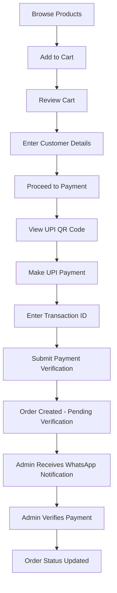
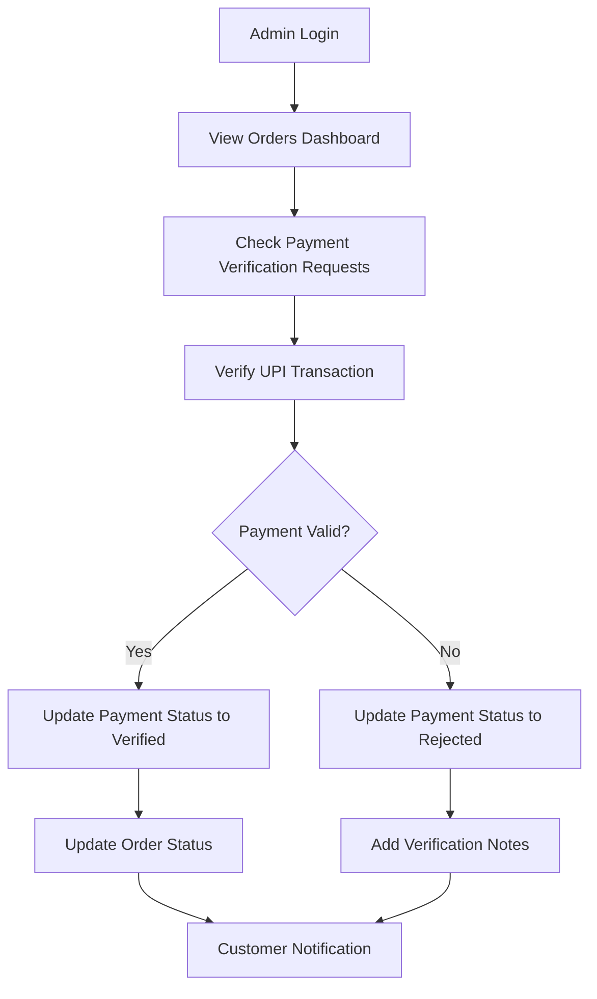
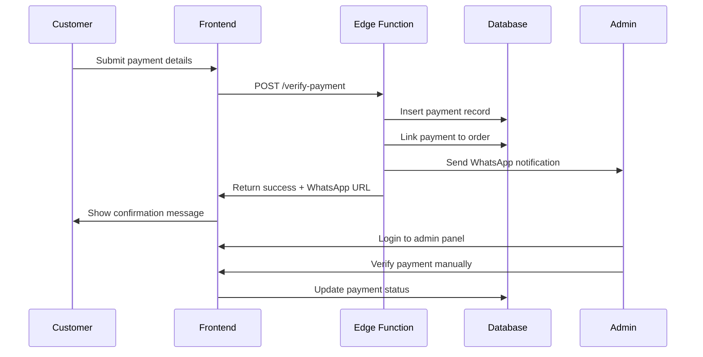

# Spice & Health Products E-commerce Web Application

## Project Overview

A modern React-based e-commerce platform for selling spices and health products with integrated UPI payment system, order management, and admin dashboard.

## 🚀 Technology Stack

- **Frontend**: React 18, TypeScript, Vite
- **Styling**: Tailwind CSS, shadcn/ui components
- **Backend**: Supabase (PostgreSQL, Edge Functions, Authentication)
- **Payment**: Custom UPI QR-based payment system with manual verification
- **State Management**: React Context API
- **Routing**: React Router DOM
- **Notifications**: WhatsApp integration for admin alerts

## 📁 Project Structure

```
src/
├── components/
│   ├── ui/                    # shadcn/ui base components
│   ├── AdminLogin.tsx         # Admin authentication component
│   ├── Cart.tsx              # Shopping cart with payment integration
│   ├── CustomerDetailsForm.tsx # Customer information form
│   ├── Header.tsx            # Main navigation header
│   ├── Hero.tsx              # Landing page hero section
│   ├── OrderHistory.tsx      # Order management for admin
│   ├── PaymentQR.tsx         # UPI QR payment interface
│   ├── ProductCard.tsx       # Individual product display
│   └── ProductGrid.tsx       # Product catalog grid
├── contexts/
│   ├── CartContext.tsx       # Shopping cart state management
│   └── OrderContext.tsx      # Order management state
├── hooks/
│   ├── use-mobile.tsx        # Mobile detection hook
│   └── use-toast.ts          # Toast notification hook
├── integrations/supabase/
│   ├── client.ts             # Supabase client configuration
│   └── types.ts              # Auto-generated database types
├── lib/
│   ├── supabase.ts           # Supabase utilities
│   └── utils.ts              # General utility functions
├── pages/
│   ├── Admin.tsx             # Admin dashboard
│   ├── Index.tsx             # Main landing page
│   ├── NotFound.tsx          # 404 error page
│   └── Story.tsx             # Brand story page
├── assets/                   # Product images and static assets
├── App.tsx                   # Main application component
├── main.tsx                  # Application entry point
└── index.css                 # Global styles and design tokens

supabase/
├── functions/
│   └── verify-payment/       # Payment verification edge function
├── migrations/               # Database migration files
└── config.toml              # Supabase configuration
```

## 🗄️ Database Schema

### Tables

#### `profiles`
- `id` (UUID, Primary Key) - User ID from auth
- `full_name` (TEXT) - User's full name
- `phone` (TEXT) - Phone number
- `created_at`, `updated_at` (TIMESTAMP)

#### `orders`
- `id` (UUID, Primary Key) - Order ID
- `user_id` (UUID) - Reference to user
- `customer_name` (TEXT) - Customer name
- `customer_phone` (TEXT) - Customer phone
- `customer_address` (TEXT) - Delivery address
- `total` (NUMERIC) - Order total amount
- `status` (TEXT) - Order status (received, processing, shipped, delivered)
- `payment_id` (UUID) - Reference to payment
- `created_at`, `updated_at` (TIMESTAMP)

#### `order_items`
- `id` (UUID, Primary Key)
- `order_id` (UUID) - Reference to order
- `product_name` (TEXT) - Product name
- `price` (NUMERIC) - Product price
- `quantity` (INTEGER) - Quantity ordered
- `created_at` (TIMESTAMP)

#### `payments`
- `id` (UUID, Primary Key)
- `order_id` (UUID) - Reference to order
- `transaction_id` (TEXT) - UPI transaction ID
- `amount` (NUMERIC) - Payment amount
- `user_name` (TEXT) - Customer name
- `user_phone` (TEXT) - Customer phone
- `payment_method` (TEXT) - Payment method (default: UPI)
- `status` (TEXT) - Payment status (pending, verified, rejected)
- `verification_notes` (TEXT) - Admin verification notes
- `created_at`, `updated_at` (TIMESTAMP)

### Row Level Security (RLS) Policies

- **Users** can only access their own orders and payments
- **Admins** (phone numbers: 9986918992, 1234567890) can access all data
- **Public** can insert payment records for verification

## 🔄 Application Flows

### 1. Customer Purchase Flow



### 2. Admin Management Flow



### 3. Payment Verification Flow



## 🛠️ Key Features

### Customer Features
- **Product Catalog**: Browse spices and health products
- **Shopping Cart**: Add/remove items, quantity management
- **Secure Checkout**: Customer details form with validation
- **UPI Payment**: QR code-based payment with manual verification
- **Order Tracking**: View order status and history

### Admin Features
- **Order Management**: View and manage all orders
- **Payment Verification**: Manual verification of UPI transactions
- **Status Updates**: Update order status (processing, shipped, delivered)
- **WhatsApp Notifications**: Automatic alerts for new payment verifications

### Technical Features
- **Responsive Design**: Mobile-first approach with Tailwind CSS
- **Real-time Updates**: Supabase real-time subscriptions
- **Type Safety**: Full TypeScript implementation
- **Authentication**: Supabase auth with profile management
- **Error Handling**: Comprehensive error handling with toast notifications

## 🚀 Setup Instructions

### Prerequisites
- Node.js 18+ and npm
- Supabase account and project

### Installation

1. **Clone the repository**
```bash
git clone <repository-url>
cd <project-name>
```

2. **Install dependencies**
```bash
npm install
```

3. **Environment Setup**
- Supabase URL and keys are configured in `src/integrations/supabase/client.ts`
- No additional environment variables needed

4. **Database Setup**
- Run migrations: `npm run db:push` (if using Supabase CLI)
- Or apply the migration files manually in Supabase dashboard

5. **Start Development Server**
```bash
npm run dev
```

### Deployment

1. **Build the application**
```bash
npm run build
```

2. **Deploy to your preferred platform**
- Vercel, Netlify, or any static hosting service
- Supabase edge functions are deployed automatically

## 🔧 Configuration

### Admin Access
- Admin phone numbers are configured in RLS policies: `9986918992`, `1234567890`
- To add more admins, update the RLS policies in the database

### Payment Configuration
- UPI ID: `shishirdixit3092003@ybl`
- QR Code: Located in `public/lovable-uploads/`
- WhatsApp notification phone: `9986918992`

### Product Catalog
- Products are hardcoded in `ProductGrid.tsx`
- Images stored in `src/assets/`
- To add products, update the products array in the component

## 🔍 API Documentation

### Edge Functions

#### `/verify-payment`
**POST** - Verify UPI payment and notify admin

**Request Body:**
```json
{
  "orderId": "string",
  "transactionId": "string", 
  "amount": "number",
  "customerName": "string",
  "customerPhone": "string"
}
```

**Response:**
```json
{
  "success": true,
  "paymentId": "uuid",
  "whatsappUrl": "string",
  "message": "string"
}
```

## 🛡️ Security Features

- **Row Level Security**: Database-level access control
- **Input Validation**: Zod schemas for form validation
- **XSS Protection**: React's built-in XSS protection
- **CORS Configuration**: Proper CORS headers for edge functions
- **Authentication**: Supabase auth with secure session management

## 🐛 Troubleshooting

### Common Issues

1. **Payment verification fails**
   - Check edge function logs in Supabase dashboard
   - Verify order ID format and database constraints

2. **Admin login issues**
   - Ensure phone number matches RLS policy configuration
   - Check authentication status in browser dev tools

3. **Database connection errors**
   - Verify Supabase URL and keys in client configuration
   - Check network connectivity and CORS settings

### Debugging

- **Frontend**: Use browser dev tools and React DevTools
- **Backend**: Check Supabase logs and edge function logs
- **Database**: Use Supabase SQL editor for direct queries

## 📱 Mobile Responsiveness

- Fully responsive design using Tailwind CSS
- Mobile-optimized components and layouts
- Touch-friendly UI elements
- Progressive Web App (PWA) ready

## 🔮 Future Enhancements

- **Automated Payment Verification**: Integration with UPI payment gateways
- **Real-time Notifications**: Push notifications for order updates
- **Inventory Management**: Stock tracking and management
- **Analytics Dashboard**: Sales and performance metrics
- **Customer Reviews**: Product rating and review system
- **Multi-language Support**: Internationalization
- **Delivery Tracking**: Real-time delivery status